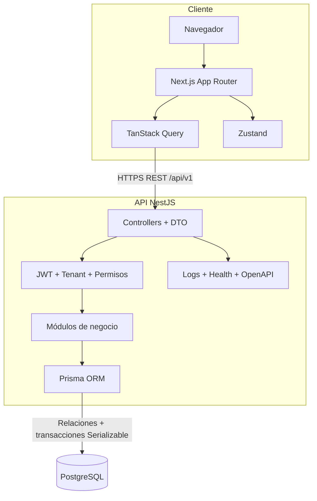

# Diagrama de Arquitectura

```mermaid
flowchart TB
    subgraph Client[Cliente]
        Browser[Navegador]
        Web[Next.js App Router]
        Query[TanStack Query]
        Store[Zustand]
        Browser --> Web
        Web --> Query
        Web --> Store
    end

    subgraph Service[API NestJS]
        HTTP[Controllers + DTO]
        Guards[JWT + Tenant + Permisos]
        Modules[Módulos de negocio]
        Prisma[Prisma ORM]
        Obs[Logs + Health + OpenAPI]
        HTTP --> Guards --> Modules --> Prisma
        HTTP --> Obs
    end

    Query -->|HTTPS REST /api/v1| HTTP
    Prisma -->|Relaciones + transacciones Serializable| PostgreSQL[(PostgreSQL)]
```

La web puede desplegarse separada de la API. PostgreSQL es la única dependencia esencial del MVP; Redis y servicios de correo quedan fuera.
