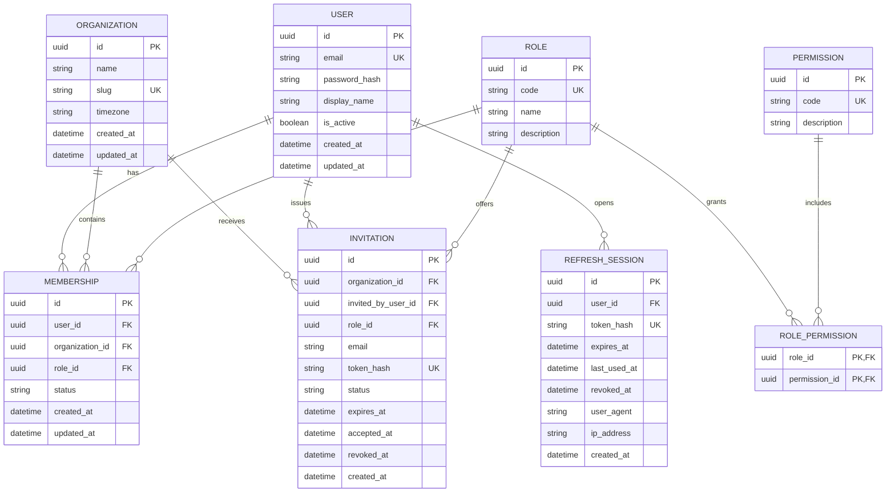

# ER — Identidad, Organizaciones y RBAC

```mermaid
erDiagram
    USER {
        uuid id PK
        string email UK
        string password_hash
        string display_name
        boolean is_active
        datetime created_at
        datetime updated_at
    }
    ORGANIZATION {
        uuid id PK
        string name
        string slug UK
        string timezone
        datetime created_at
        datetime updated_at
    }
    ROLE {
        uuid id PK
        string code UK
        string name
        string description
    }
    PERMISSION {
        uuid id PK
        string code UK
        string description
    }
    ROLE_PERMISSION {
        uuid role_id PK, FK
        uuid permission_id PK, FK
    }
    MEMBERSHIP {
        uuid id PK
        uuid user_id FK
        uuid organization_id FK
        uuid role_id FK
        string status
        datetime created_at
        datetime updated_at
    }
    INVITATION {
        uuid id PK
        uuid organization_id FK
        uuid invited_by_user_id FK
        uuid role_id FK
        string email
        string token_hash UK
        string status
        datetime expires_at
        datetime accepted_at
        datetime revoked_at
        datetime created_at
    }
    REFRESH_SESSION {
        uuid id PK
        uuid user_id FK
        string token_hash UK
        datetime expires_at
        datetime last_used_at
        datetime revoked_at
        string user_agent
        string ip_address
        datetime created_at
    }
    USER ||--o{ MEMBERSHIP : has
    ORGANIZATION ||--o{ MEMBERSHIP : contains
    ROLE ||--o{ MEMBERSHIP : assigns
    ROLE ||--o{ ROLE_PERMISSION : grants
    PERMISSION ||--o{ ROLE_PERMISSION : includes
    ORGANIZATION ||--o{ INVITATION : receives
    USER ||--o{ INVITATION : issues
    ROLE ||--o{ INVITATION : offers
    USER ||--o{ REFRESH_SESSION : opens
```

Claves compuestas: `Membership(userId, organizationId)` y `RolePermission(roleId, permissionId)`.
