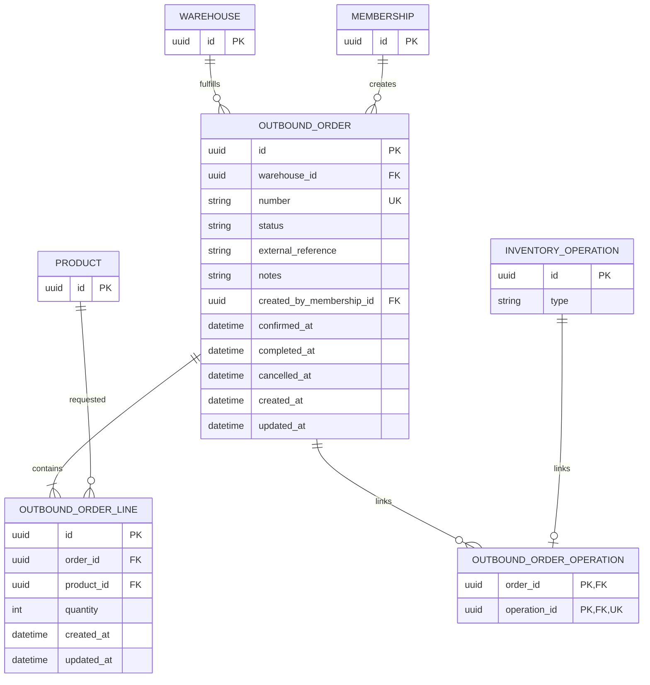

# ER — Órdenes y Reservas

```mermaid
erDiagram
    WAREHOUSE {
        uuid id PK
    }
    MEMBERSHIP {
        uuid id PK
    }
    PRODUCT {
        uuid id PK
    }
    INVENTORY_OPERATION {
        uuid id PK
        string type
    }
    OUTBOUND_ORDER {
        uuid id PK
        uuid warehouse_id FK
        string number UK
        string status
        string external_reference
        string notes
        uuid created_by_membership_id FK
        datetime confirmed_at
        datetime completed_at
        datetime cancelled_at
        datetime created_at
        datetime updated_at
    }
    OUTBOUND_ORDER_LINE {
        uuid id PK
        uuid order_id FK
        uuid product_id FK
        int quantity
        datetime created_at
        datetime updated_at
    }
    OUTBOUND_ORDER_OPERATION {
        uuid order_id PK, FK
        uuid operation_id PK, FK, UK
    }
    WAREHOUSE ||--o{ OUTBOUND_ORDER : fulfills
    MEMBERSHIP ||--o{ OUTBOUND_ORDER : creates
    OUTBOUND_ORDER ||--|{ OUTBOUND_ORDER_LINE : contains
    PRODUCT ||--o{ OUTBOUND_ORDER_LINE : requested
    OUTBOUND_ORDER ||--o{ OUTBOUND_ORDER_OPERATION : links
    INVENTORY_OPERATION ||--o| OUTBOUND_ORDER_OPERATION : links
```

Claves compuestas: renglón único por orden/producto y relación orden–operación. Todos los productos deben pertenecer al tenant derivado del almacén.
